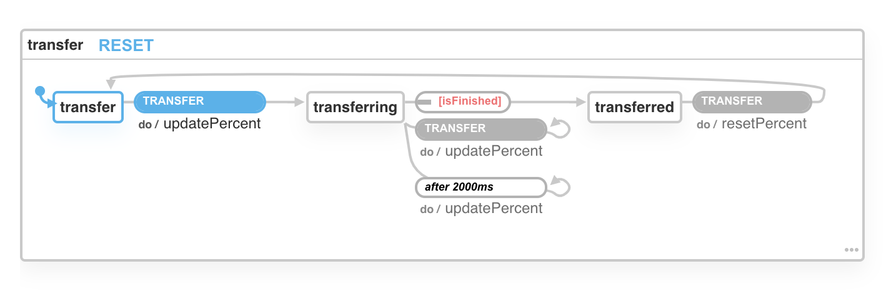
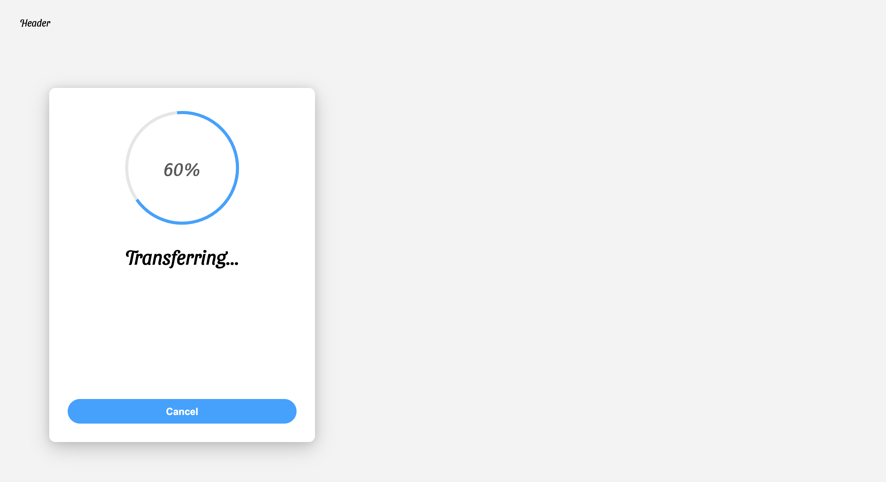

  <h1>
     
     
    
     
    <a href="https://practical-swanson-a56b9a.netlify.app/" target="_blank">
        An uploader component with progress bar and finite-state machine.
    </a>
     
     
  </h1>
  
  
   
   
   
   
  <pre>yarn install && yarn start</pre>
   

### Used libraries:

- [`react`](https://github.com/facebook/react)
- [`xstate`](https://github.com/davidkpiano/xstate)
- [`emotion`](https://github.com/emotion-js/emotion)

### Finite-States Machines

In this application I used xstate for having finite-state machine that makes our life easier to have different states of an application or components. for more information search "xstate".

  <h1>
    
    
  </h1>
  
  
   
  <pre>By Xstate</pre>
   

